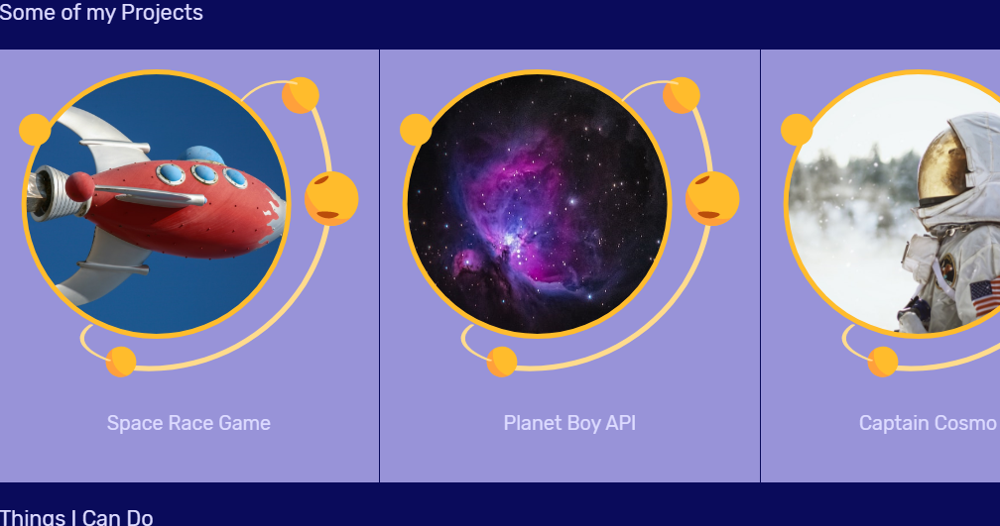
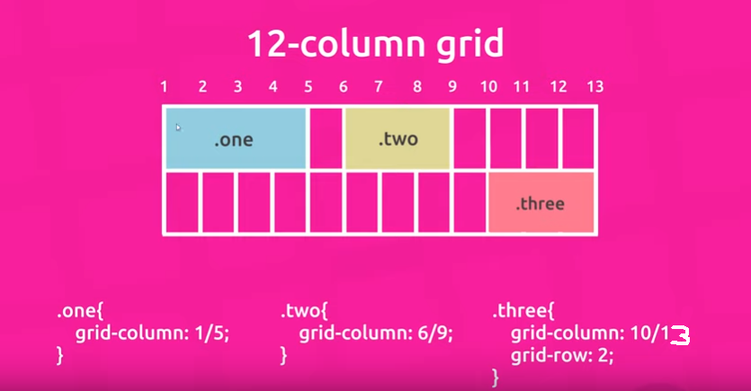
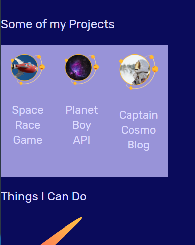

```
.projects {
display: grid;
grid-template-columns: 1fr 1fr 1fr;
gap: 1px;
}
.projects a {
text-align: center;
background: #9893d8;
padding: 20px;
}

 <div className="projects grid">
          <a href="#">
            
            <h4>Space Race Game</h4>
          </a>
          <a href="#">
            
            <h4>Planet Boy API</h4>
          </a>
          <a href="#">
            
            <h4>Captain Cosmo Blog</h4>
          </a>
 </div>
```



Image Size Changed:
```
.projects {
display: grid;
grid-template-columns: repeat(12, 1fr);
gap: 1px;
}
.projects a {
text-align: center;
background: #9893d8;
padding: 20px;
}

.projects img {
max-width: 100%;
}
```


Displaying On The Grid in Rows:
```
.projects {
display: grid;
grid-template-columns: repeat(12, 1fr);
gap: 1px;
}
.projects a {
text-align: center;
background: #9893d8;
padding: 20px;
}

.projects img {
max-width: 100%;
}
.projects a:nth-child(1) {
grid-column: 2/6;
grid-row: 1;
}
.projects a:nth-child(2) {
grid-column: 8/12;
grid-row: 1;
}
.projects a:nth-child(3) {
grid-column: 5/9;
grid-row: 2;
}
```

