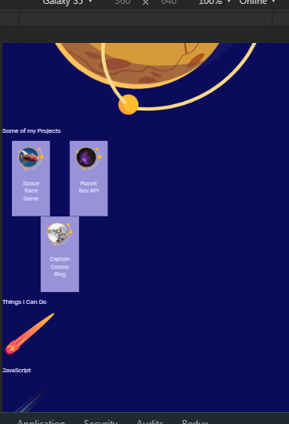
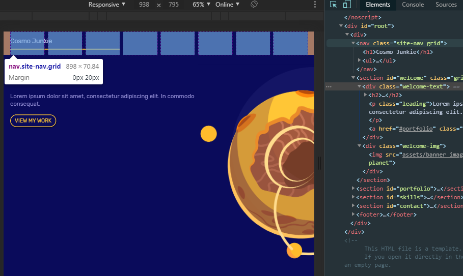
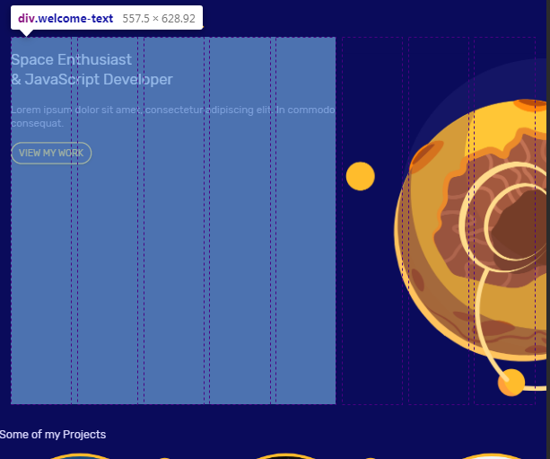
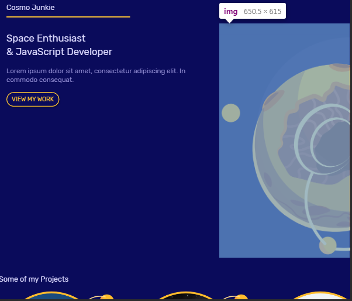
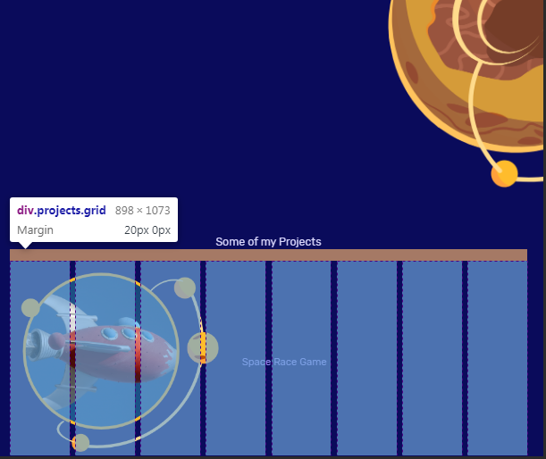
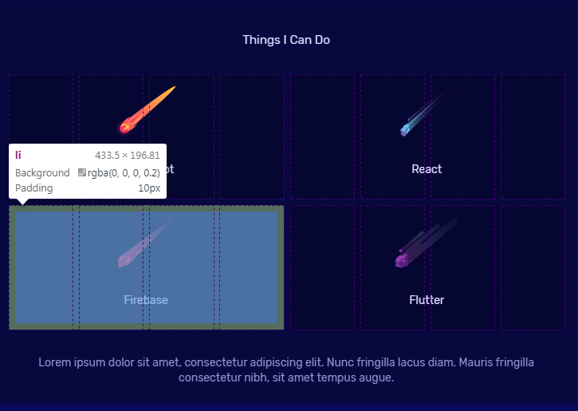

```
/* mobile styles */
.grid {
  display: grid;
  grid-template-columns: repeat(8, 1fr);
  gap: 10px;
  box-sizing: border-box;
}
.site-nav {
  margin: 0 20px;
}
.site-nav h1 {
  grid-column: 1/4;
  grid-row: 1;
  padding-bottom: 10px;
  border-bottom: 3px solid var(--primary);
  display: inline-block;
}
.site-nav ul {
  display: none;
}
#welcome {
  padding: 0 20px 20px 20px;
}
.welcome-text {
  grid-column: 1/6;
}
.welcome-text a {
  margin: 20px 0;
}
.welcome-img {
  grid-column: 6/9;
}
.welcome-img img {
  width: 200%;
}
```




```
#portfolio {
  /* background: url("assets/square_bg.png");
  <Image source={require('../assets/background1.jpg')} /> */

background-size: cover;
background-repeat: no-repeat;
background-position: bottom;
padding: 30px 20px;
}
#portfolio h3 {
margin-bottom: 0;
text-align: center;
}
.projects {
margin: 20px 0;
}
.projects a {
grid-column: 1/9;
display: flex;
margin: 20px 0;
}
.projects a \* {
margin: 0 20px;
max-width: 40%;
align-self: center;
}
.projects h4 {
color: #9994f7;
}

```


```

#skills {
padding: 30px 20px;
background: #07083e;
}
#skills h3 {
text-align: center;
}
#skills ul {
margin: 40px 0;
}
#skills li {
padding: 10px;
background: rgba(0, 0, 0, 0.2);
grid-column: span 4;
text-align: center;
}
#skills img {
height: 80px;
margin: 10px auto;
}
#skills p {
text-align: center;
margin: 0 20px;
}

```


